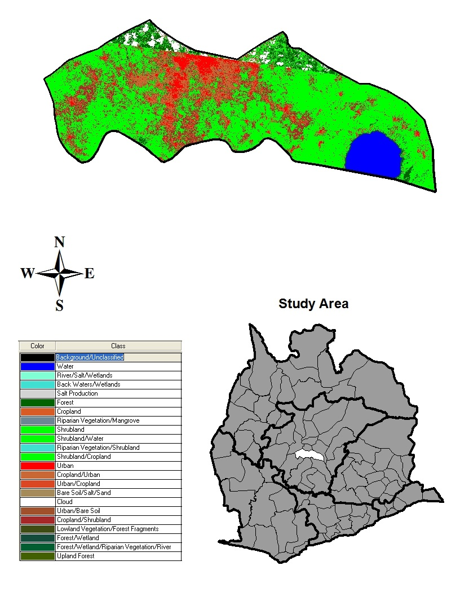

```{r, message = F, results = 'hide', include = F}
#### Libraries
library(foreign)
library(shapefiles)
library(sp)
library(CARBayes)
library(maptools)
library(spdep)
library(splines)
library(PBSmapping)
library(knitr)
library(ggplot2)
```


```{r, echo = F}
#### Reading in Data
path<-"C:/Users/spileggi/Google Drive/Senior Project/Jake Frattone/BUprojectData/"
LandCoverPercentsBydistrict <- read.csv(paste(path,"LandCoverPercentsBydistrict.csv",sep=""))

#populations = read.dbf('E:/CarModelData/populationDistrict.dbf')
#popTemp = data.frame(ADM2 = populations$dbf$NAME_2, population = populations$dbf$reg_pop_pr)
populations = read.csv(paste(path,"finalDistrictPop.csv",sep=""))

healthCenter = read.dbf(paste(path,"healthCenterCountsByDistrict.dbf",sep=""))
healthCenterup = data.frame(ADM2 = healthCenter$dbf$ADM2, hcCount= healthCenter$dbf$Count_)


#making hosp count data
hospital = read.dbf(paste(path,"HospitalCountsByDistrict.dbf",sep=""))
hospitalup = data.frame(ADM2 = hospital$dbf$ADM2, hospCount= hospital$dbf$Count_)
dataHealth = merge(healthCenterup, hospitalup, by = 'ADM2')

#data file
updated = merge(dataHealth, LandCoverPercentsBydistrict, by='ADM2')
updated = merge(updated, populations, by = 'ADM2')

#adding in factor variable for total cases
#updated$totalCasesF[updated$t]

#adding ID variable to avoid error 
updated$ID = (1:89)
#re-arrange column order - ID is now first
updated <- updated[,c(16,1:15)]


#DBF FILE
dbfTemp = data.frame(ID = 1:89,ADM2 = sort(healthCenterup$ADM2))

dbf = list(dbf = dbfTemp, header = FALSE )


#importing shape file(.shp file name extension not necessary)

shapefile = read.shapefile(paste(path,"tempShapeFile",sep=""))
#length(shapefile)
#names(shapefile)

#----------------------------------------------
#create dbf file
GHANAdbf<-shapefile$dbf
#remove FID, only use ID
GHANAdbf[[1]]<-GHANAdbf[[1]][,-1]

#----------------------------------------------

#----------------------------------------------
#create shp file
GHANAshp<-shapefile$shp

#length(GHANAshp)
#names(GHANAshp)
#remove FID, only use ID
GHANAdbf[[1]]<-GHANAdbf[[1]][,-1]

#----------------------------------------------

#This works using the maptools packaged, but returns shapefile in a different format than needed by CARBayes
#shapefile = readShapeSpatial('E:/CarModelData/tempShapeFile.shp')
#plot(shapefile)

small = data.frame(ADM2 = GHANAdbf$dbf$ADM2_1, TotalCases = GHANAdbf$dbf$TotalCases)

new = merge(small, updated, by = 'ADM2' )
```

 
```{r, echo = F}
#### Creating Spatial Polygons Object
#----------------------------------------------
##converting data to spatial polygons data frame

#data.combined = combine.data.shapefile(data = updated, shp = GHANAshp, dbf = GHANAdbf)

data.combined = combine.data.shapefile(data = new, shp = GHANAshp, dbf = dbf)
```

# Introduction
Buruli ulcer (BU) is an infection caused by _Mycobacterium ulcerans_ ( _4_ ).  The infection  usually begins with a harmless looking pimple or rash.  When left without treatment the rash flares up and may result in deformities, loss of limbs or organs, and sometimes death ( _1_ ).  The only treatments currently known for BU are an antibiotic regimen and surgery ( _1_ , _4_ ).  Also the way in which BU is spread is not currently known.  It has been hypothesized that BU is a waterborne disease, but we cannot be sure of this.  BU is fairly widespread and has been reported in almost 27 countries ( _1_ ).  Most of the countries that have reported BU cases are in the tropical areas of West Africa.  This includes Ghana, our primary area of study for this project.

## Study Area

_Figure 1. Geographic Representation of the Project Study Area_ 


This project involved 89 districts in Southern Ghana.  These 89 districts are located in the regions of Brong Ahafo, Ashanti, Eastern, Greater Accra, Central, and Western.  We limited our research to this portion of Ghana because these were the only regions that we have reported Buruli ulcer data on. 

# Materials and Methods
## Data Sources 
__1.  Hospital and Health Center Locations and Population Projections:__  The locations for all of the hospital and health center and population projections were found on Harvard's WorldMap Project website. https://worldmap.harvard.edu/ghana-health/. The data was collected by the Virtue Foundation, a philanthropic institute.
  
__2.  Land Use and Land Cover Satelite Images:__  The satellite image used to calculate the land use and land cover data came from ASTER GDEM. This is the Advanced Spaceborne Thermal Emission and Reflection Radiometer (ASTER) Global Digital Elevation Model (GDEM) 


_Figure 2. Example of How Land use and Land Cover data is calculated for the District of Botsomtwe/Atwima/Kwanhuma_


_Table 1. Land Use and Land Cover Percentages of Botsomtwe/Atwima/Kwanhuma District_
```{r, echo = F}
land = data.combined@data[data.combined@data$ADM2 == 'Botsomtwe/Atwima/Kwanhuma',6:16]
land = round(land*100,2)

original = names(land) 
new = substr(original, 1, nchar(original)-7)
colnames(land) = new
kable(land, format = 'markdown', row.names = F)
```

**where:** <br>
**WaterPercent** = Water <br>
**WetlandsPercent** = River/Salt/Wetlands + Back Waters/Wetlands <br>
**SaltPercent** = Salt Production <br>
**ForestPercent** = Forest + Lowland Vegetation/Forest + Forest/Wetland + Forest/Wetland/Riparian Vegetation/River + Upland Forest <br>
**CroplandPercent** = Cropland + Cropland/Urban + Cropland/shrubland <br>
**RiparianPercent** = Riparian Vegetation/Mangrove + Riparian Vegetation/Shrubland <br>
**ShrublandPercent** = Shrubland + Shrubland/Water + Shrubland/Cropland <br>
**UrbanPercent** = Urban + Urban/Cropland + Urban/Bare Soil <br>
**SandPercent** = Bare Soil/Salt/Sand <br>
**BackgroundPercent** = Background/Unclassified <br>

All these values were divided by the total area of each district to get the estimated percentage of Land. 

__3.  The Frequency of Buruli ulcer Cases:__  The data on the Buruli ulcer cases came from communities or towns in Ghana that reported occurrences of the disease. It should be noted that there are most likely multiple BU cases that are not reported.  

### Potential Explanatory Variables For Model Analysis 
1.  Population 
2.  Total Health Facilities
3.  Shrubland Percent
4.  Water Percent 
5.  Water Presence
6.  Wetlands Percent
7.  Salt Percent
8.  Forest Percent
9.  Cropland Percent
10.  Riparian Percent
11.  Urban Percent 
12.  Sand Percent 
13.  Total Health Centers
14.  Total Hospitals

## Model Selection
The model was selected by first fitting the full model with all explanatory variables.  The insignificant effects were then dropped from the model using a backword elimination method at the 5% significance level $(\alpha = .05)$.  This new model was predicting the total number of BU cases with the predictor variables Shrubland Percent, Total Health Centers, Total Hospitals, and Water Percent.  After looking at the residuals for this model we decided to add in an offset variable of the population projections for each district.  The offset variable was used to model the rate of BU cases for each district.  We also decided to transform the Water Percent, Total Health Centers, and Total Hospitals variables.  The Water Percent variable was converted into the Water Presence variable.  Where water Presence is 0 if there is no water in the district, and water Presence is 1 if there is water in the district.  The Total Health Centers and Total Hospitals variables were added together to create the Total Health Facilities variable.  We modified these variables in order to create a more interpretable and parsimonious model.  The Akaike Information Criterion (AIC) was also used in the model selection process.  The AIC can be used to find the best model by picking the model with the lowest (AIC)

We then decided to try and run the model without the offset variable and instead predict the rate of BU cases per every 10,000 people.  This is because we had extremely unusual residuals for both the non-spatial and spatial models.  After running this analysis the spatial model still had some problematic residuals, so we decided not to use it.  However, the non-spatial model's total health facilities effect was now no longer statistically significant.  So we decided to drop this effect.  This new model had a much lower AIC than the second non-spatial model that predicted the total cases, so we decided that this was the best model.  

## Analysis Methods
Once the data was collected we implemented a Poisson regression model in order to predict the total number of Buruli ulcer cases from 2002 to 2008. The explanatory variables used in the model were the total number of health facilities, population offset, the percent of shrubland, and an indicator variable for the presence of water in each district. 

__Poisson Model__ ( _3_ ):
$$log(\mu) = \beta_0 + \beta_1x_1 + ... + \beta_kx_k $$
_Where_: 

$\mu$ = Average Buruli ulcer Case Rate Per (10,000 People)

After running the Poisson model we were interested in running a Bayesian Car Model as well.  Before doing so, a Moran Spatial Autocorrelation test was run to determine if the spatial model would be necessary.

__Moran's I__ ( _3_ ):


$$ 
I = 
  \frac{n\sum_i\sum_jw_{ij}(y_i - \bar{y})(y_j - \bar{y})}
  {(\sum_{i \neq j}w_{ij})(y_i - \bar{y})^2}
$$ 

_Where_:

  $n$ = total number of observations <br>
  $y_i, y_j$ = Total cases in districts i and j <br>
  $\bar{y}$ = average Total cases of all districts <br>
  $w_{ij}$ = entries of proximity matrix <br>
  
The Moran spatial autocorrelation statistic ranges from -1 to 1, similiar to the correlation coefficient.  A positive Moran's value signifies positive spatial correlation or clustering between the districts.  A negative statistic represents despersion or negative spatial autocorrelation ( _2_ ).

If the $y_i$s are independently and identically distributed and have no spatial autocorrelation, then the Moran's statistic is normally distributed ( _3_ ).

  $$\mu = \frac{-1}{(n-1)}$$ <br>
  $$\sigma^2 = \frac{n^2(n-1)S_1 - n(n-1)S_2 - 2S_0^2}{(n+1)(n-1)^2S_0^2}$$ 
  $$S_0 = \sum_{i \neq j}w_{ij}$$ 
  $$S_1 = \frac{1}{2}\sum_{i \neq j}(w_{ij}+w_{ji})^2$$ 
  $$S_2 = \sum_j(\sum_{j}w_{ij} + \sum_iw_{ji})^2$$<br> 
  $$I \sim N(\mu,\sigma^2)$$
The spatial Bayesian Car Model was used to predict the total number of Buruli Cases from 2002 to 2008.  The same explanatory variables were used as in the non-spatial model. 

__Spatial Bayesian CAR Model__ ( _3_ ):

$$Y_k \sim Poisson(\mu_k) = x_k\beta + O_k + \psi_k $$

$$\psi_k = \phi_k + \theta_k$$ <br>
$$\phi_k|\phi_{-k}, W, \tau^2 \sim N\left(\frac{\sum_{i=1}^Kw_{ki}\phi_i}{\sum_{i=1}^Kw_{ki}},\frac{\tau^2}{\sum_{i=1}^Kw_{ki}}\right)$$ <br>
$$\theta_k \sim N(0,\sigma^2)$$ <br>
$$\tau^2, \sigma^2 \sim Inverse-Gamma(a,b)$$<br>

# RESULTS

## Visualizations of Gathered Data

_Figure 3. Total Number of Buruli Ulcer Cases (2002-2008) For Each Ghana District_
```{r, echo = F}
#### Total Buruli Cases by each Ghana District
#adding in factor variable for total cases

data.combined@data$TotalCasesF[data.combined@data$TotalCases == 0] = 1
data.combined@data$TotalCasesF[data.combined@data$TotalCases >= 1 & data.combined@data$TotalCases <= 25] = 2
data.combined@data$TotalCasesF[data.combined@data$TotalCases >= 26 & data.combined@data$TotalCases <= 50] = 3
data.combined@data$TotalCasesF[data.combined@data$TotalCases >= 51 & data.combined@data$TotalCases <= 75] = 4
data.combined@data$TotalCasesF[data.combined@data$TotalCases >= 76 & data.combined@data$TotalCases <= 100] = 5
data.combined@data$TotalCasesF[data.combined@data$TotalCases >= 101 & data.combined@data$TotalCases <= 175] = 6
data.combined@data$TotalCasesF[data.combined@data$TotalCases >= 176 & data.combined@data$TotalCases <= 250] = 7
data.combined@data$TotalCasesF[data.combined@data$TotalCases >= 251 & data.combined@data$TotalCases <= 300] = 8
data.combined@data$TotalCasesF[data.combined@data$TotalCases >= 301 & data.combined@data$TotalCases <= 350] = 9
data.combined@data$TotalCasesF[data.combined@data$TotalCases >= 351 & data.combined@data$TotalCases <= 400] = 10


lab = c('0 Cases', '1-25 Cases','26-50 Cases','51-75 Cases','76-100 Cases', '101-175 Cases', '176-250 Cases', '251-300 Cases', '301-350 Cases', '351-400 Cases')
data.combined@data$TotalCasesF = factor(data.combined@data$TotalCasesF, labels = lab)

northarrow <- list("SpatialPolygonsRescale", layout.north.arrow(),offset = c(5e+05,9e+05), scale = 30000)
scalebar <- list("SpatialPolygonsRescale", layout.scale.bar(),offset = c(8e+05,5.5e+05), scale = 80000, fill=c("transparent","black"))
text1 <- list("sp.text", c(7.9e+05,5.7e+05), "0")
text2 <- list("sp.text", c(8.8e+05,5.7e+05), "65 km")

breakpoints <- seq(min(data.combined$TotalCases)-1, max(data.combined$TotalCases)+1, length.out=8)

breakpoints <- c(0,1,50,100,150,200,250,300,350,400)
colorz = c('gray','lightgreen','darkgreen','yellow', 'yellow2', 'yellow3', 'yellow4', 'red', 'red3', 'red4', 'black')

## new legend with factorized total cases
spplot(data.combined, c('TotalCasesF'),sp.layout=list(northarrow, scalebar,text1, text2), 
       scales=list(draw = F),col.regions= colorz, col="black")
```

```{r, include = F, echo = FALSE}
# Creating Factorized Population Variable
population = sort((unique(data.combined@data$pop)))[1:86]
popBreak = hist(population)$breaks
popBreak = c(popBreak,2500000)
lab = c('0-50000', '50001-100000', '100001-150000', '150001-200000', '200001-250000', '2500001-300000',
           '300001-500000', '500000<Population<2500000')

for (i in 1:11){
  data.combined@data$popF[data.combined@data$pop>popBreak[i] & data.combined@data$pop<popBreak[i+1]] = i
}
data.combined@data$popF = factor(data.combined@data$popF, labels = lab)

```

_Figure 4. Ghana Population Projections (2008)_
```{r, echo = F}

#### Ghana Population for each District
### Population by District Plot
colPop = terrain.colors(n=length(lab))
spplot(data.combined, c('popF'),sp.layout=list(northarrow, scalebar,text1, text2), 
       scales=list(draw = F), col.regions = colPop,col="black")
```

_Figure 5. Ghana Hospital Counts_ <br>
```{r, echo = FALSE}
#### Ghana Hospital Counts for each District
### Hospital Counts By district

hbreak = sort(unique(data.combined@data$hospCount))
data.combined@data$hospCountF = NULL
for(i in as.numeric(hbreak)){
  data.combined@data$hospCountF[data.combined@data$hospCount == i] = i
}
data.combined@data$hospCountF = factor(data.combined@data$hospCountF, labels = paste(hbreak,'Hospitals'))

#Side by side graphs

colh = c('gray',terrain.colors(n=length(hbreak)-1))
spplot(data.combined, c('hospCountF'),sp.layout=list(northarrow, scalebar,text1, text2), 
       scales=list(draw = F), col.regions = colh,col="black")


```

_Figure 6. Ghana Health Center Counts_
```{r, echo = F}
#### Ghana Health Center for each District
### Health Center Counts By district

hcbreak = sort(unique(data.combined@data$hcCount))
data.combined@data$hcCountF = NULL
for(i in as.numeric(hcbreak)){
  data.combined@data$hcCountF[data.combined@data$hcCount == i] = i
}
data.combined@data$hcCountF = factor(data.combined@data$hcCountF, labels = paste(hcbreak,'Health Centers'))


colhc = c('gray',terrain.colors(n=length(hcbreak)-1))

spplot(data.combined, c('hcCountF'),sp.layout=list(northarrow, scalebar,text1, text2), 
       scales=list(draw = F), col.regions = colhc,col="black")
 

```

_Figure 7. Ghana Total Health Facilities Counts_
```{r, echo = F}
### Ghana Total Health Facilities variable
data.combined@data$TotalHealthFacilities = 
  data.combined@data$hcCount +
  data.combined@data$hospCount

totalBreak = c(1,5,6,10,11,14,15,19,20,24)
data.combined@data$TotalHealthFacilitiesF = data.combined@data$TotalHealthFacilities
data.combined@data$TotalHealthFacilitiesF[data.combined@data$TotalHealthFacilities == 0] = 1

data.combined@data$TotalHealthFacilitiesF[data.combined@data$TotalHealthFacilities>=1 & data.combined@data$TotalHealthFacilities<=5] = 2

data.combined@data$TotalHealthFacilitiesF[data.combined@data$TotalHealthFacilities>=6 & data.combined@data$TotalHealthFacilities<=10] = 3
                                          
data.combined@data$TotalHealthFacilitiesF[data.combined@data$TotalHealthFacilities>=11 & data.combined@data$TotalHealthFacilities<=14] = 4

data.combined@data$TotalHealthFacilitiesF[data.combined@data$TotalHealthFacilities>=15 & data.combined@data$TotalHealthFacilities<=19] = 5

data.combined@data$TotalHealthFacilitiesF[data.combined@data$TotalHealthFacilities>=20 & data.combined@data$TotalHealthFacilities<=24] = 6

data.combined@data$TotalHealthFacilitiesF[data.combined@data$TotalHealthFacilities == 38] = 7

data.combined@data$TotalHealthFacilitiesF[data.combined@data$TotalHealthFacilities == 64] = 8

totalRanges = c('0', '1-5', '6-10', '11-14', '15-19', '20-24', '38', '64')

data.combined@data$TotalHealthFacilitiesF = factor(data.combined@data$TotalHealthFacilitiesF, labels = paste(totalRanges, 'Health Facilities'))

coltotal = c('gray',terrain.colors(n=8))

spplot(data.combined, c('TotalHealthFacilitiesF'),sp.layout=list(northarrow, scalebar,text1, text2), 
       scales=list(draw = F), col.regions = coltotal,col="black")
 
```

_Figure 8. Histogram of Shrubland Percentages for all Ghana Districts in Study Area_
```{r, echo = F, message = F}
ggplot(data = data.combined@data,aes(data.combined@data$ShrublandPercent))+
         geom_histogram(col = 'black', 
                        fill = 'grey') + 
labs(title = '') +
labs(x = '% Shrubland in Each District', 
     y = 'Count') 

```

_Figure 9. Histogram of Water Percentages for all Ghana Districts in Study Area_
```{r, echo = F, message= F}
ggplot(data = data.combined@data,aes(data.combined@data$WaterPercent))+
         geom_histogram(col = 'black', 
                        fill = 'grey') + 
labs(title = '') +
labs(x = '% Water in Each District', 
     y = 'Count') 

```

```{r, echo = F}
#### Create Binary Presence of Water Variable
data.combined@data$WaterPresence = NULL
#some water = 1
data.combined@data$WaterPresence[data.combined@data$WaterPercent > 0] = 1
#No Water at all = 0
data.combined@data$WaterPresence[data.combined@data$WaterPercent == 0] = 0

data.combined@data$WaterPresence = factor(data.combined@data$WaterPresence, labels = c('No Water', 'Some Water'))
```

_Figure 10. Water Presence in Each Ghana District_
```{r, echo = F, message = F}
#### Water Presence for each District
par(mfrow = c(1,1))
spplot(data.combined, c('WaterPresence'),sp.layout=list(northarrow, scalebar,text1, text2), 
       scales=list(draw = F), col.regions = c('BROWN', 'BLUE'),col="black")
```

## Non Spatial Model of Total Buruli ulcer Cases
```{r, echo = F}
### Non Spatial Modelling
form = TotalCases ~ TotalHealthFacilities + ShrublandPercent + WaterPresence + offset(log(pop))
#form = TotalCases ~ hospCount + ShrublandPercent + WaterPercent
model = glm(form, data = data.combined@data, family = poisson(link=log))
summary(model)
```

$$log(\mu) = -11.295 + -.041log(x_1) + 2.281log(x_2) + 1.619log(x_3) + log(Population)$$
where: <br>
$\mu$ = Average Buruli ulcer Cases <br>
$x_1$ = Total Health Facilities <br>
$x_2$ = Shrubland Percent <br>
$x_3$ = 1 if there is water and 0 otherwise <br>


```{r, echo = F}
#### Neighborhood Matrices
### Neighborhood matrix
W.nb = poly2nb(data.combined, row.names = rownames(new))
W.mat = nb2mat(W.nb, style = 'B')
W.list = nb2listw(W.nb, style = 'B')
```

## Moran Spatial Autocorrelation Test
$H_0$: No Spatial Autocorrelation  
$H_1$: Positive Spatial Autocorrelation

Positive Spatial Autocorrelation is also known as clustering.  This is a relationship where districts with high case counts are near other high case count districts and vice versa ( _2_ ).
```{r, echo = F}
### Moran statistic to test for spatial autocorrelation
resid.model = residuals(model)
moran.mc(x=resid.model, listw = W.list, nsim=1000)

```

$H_0$: No Spatial Autocorrelation  
$H_1$: Negative Spatial Autocorrelation

Negative Spatial Autocorrelation is also called despersion.  This is a competitive relationship where districts with high case counts are near districts with low case counts and vice versa ( _2_ ).
```{r, echo = F}
### Moran statistic to test for spatial autocorrelation

moran.mc(x=resid.model, listw = W.list, alternative = 'less', nsim=1000)
```

Since large p-values were calculated for both Moran spatial autocorrelation tests, we would fail to reject the null hypotheses.  Therefore it is plausible that there is no spatial autocorrelation ( _2_ ).

```{r, results = 'hide', echo = F}
### Creating Formula to specify Response variable and predictors
form1 = TotalCases ~ TotalHealthFacilities + ShrublandPercent + WaterPresence + offset(log(pop))
form2 = TotalCases ~ TotalHealthFacilities + ShrublandPercent + WaterPresence + log(pop)

### Running Model
#model.spatial = S.CARleroux(formula = form, W=W.mat, data = data.combined@data, family = 'poisson', burnin=20000, n.sample=120000, thin=10)
#save(model.spatial,file="E:/CarModelData/spatialmodelresults.RData")
load(paste(path,"spatialmodelresults.RData",sep=""))

#model.spatial <- S.CARleroux(formula=form, data=propertydata.spatial@data,family="gaussian", W=W, burnin=20000, n.sample=120000, thin=10)


```

## Spatial Model 1 
```{r, echo = F}
print(model.spatial)

```

$$log(\mu) = -18.1045 + .0163log(x_1) + 2.9871log(x_2) + 3.1789log(x_3) + log(Population) + SpatialEffects $$
where: <br>
$\mu$ = Average Buruli ulcer Cases <br>
$x_1$ = Total Health Facilities <br>
$x_2$ = Shrubland Percent <br>
$x_3$ = 1 if there is water and 0 otherwise <br>
$Spatial Effects$  = Average effect of neighboring districts on Buruli ulcer case rate

```{r,echo = F}
## Histograms of Residuals for Spatial and Non-Spatial Model 1
# nsMin = min(data.combined@data$NonSpatialResiduals)
# nsMax = max(data.combined@data$NonSpatialResiduals)
# sMin = min(data.combined@data$SpatialResiduals)
# sMax = max(data.combined@data$SpatialResiduals)
# 
# hist(data.combined@data$NonSpatialResiduals, main = 'Non-Spatial Model Residuals', xlab = '', xlim = c(nsMin, nsMax))
# hist(data.combined@data$SpatialResiduals, main = 'Spatial Model Residuals', xlab = '', xlim = c(sMin, sMax))

```

```{r, echo = F}
## Data set 

#view = data.frame(cases = data.combined@data$TotalCases,
                  # district = data.combined@data$ADM2,
                  # HealthFacilities = data.combined@data$TotalHealthFacilities, 
                  # ShrubPercent = data.combined@data$ShrublandPercent, 
                  # Water = data.combined@data$WaterPresence,
                  # Population  = data.combined@data$pop, 
                  # NonSpatialR = data.combined@data$NonSpatialResiduals, 
                  # SpatialR = data.combined@data$SpatialResiduals)
#kable(view, format = 'markdown')

```


```{r, echo = F}
## Comparing Residuals between Spatial and Non Spatial Models

# plot(view$SpatialR~view$NonSpatialR,
#      xlab = 'Non Spatial Residuals',
#      ylab = 'Spatial Residuals')
```


```{r, echo = F}
## Non-Spatial model of Buruli ulcer Case Rate Per 10,000 People

# Creating rate variable
# data.combined@data$CaseRate=
#   (data.combined@data$TotalCases/
#   data.combined@data$pop)*10000
# 
# ### Non Spatial Modelling
# form2 = CaseRate ~ TotalHealthFacilities + ShrublandPercent + WaterPresence
# 
# NonSpatialModel2 = glm(form2, data = data.combined@data, family = poisson(link=log))
# summary(NonSpatialModel2)
```

```{r, echo = F}
### Camparing residuals between Non-Spatial Models

# data.combined@data$NonSpatialResiduals2 = 
#   residuals(NonSpatialModel2, type = 'pearson')
# plot(data.combined@data$NonSpatialResiduals~
#      data.combined@data$NonSpatialResiduals2, 
#      main = 'Comparing Residuals',
#      xlab = 'Case Rate Model',
#      ylab = 'Case Count Model')
```


```{r, echo = F}
## Spatial model of Buruli ulcer Case Rate Per 10,000 People

### Running Model
#model.spatial2 = S.CARleroux(formula = form2, W=W.mat, data = data.combined@data, family = 'poisson', burnin=20000, n.sample=120000, thin=10)
#save(model.spatial,file="E:/CarModelData/spatialmodelresults.RData")
#load("E:/CarModelData/spatialmodelresults.RData")

#model.spatial <- S.CARleroux(formula=form, data=propertydata.spatial@data,family="gaussian", W=W, burnin=20000, n.sample=120000, thin=10)
```
## Residuals for Spatial and Non-Spatial Model 1

_Figure 11. Spatial Model 1 Residuals For Each District_
```{r, echo = FALSE}
## Spatial and Non-Spatial Model 1 Residuals for each District
## Spatial
data.combined@data$SpatialResiduals = residuals(model.spatial, type = 'pearson')

SMresidsBreak = c(seq(-8,8,1))
colSM = topo.colors(n=length(SMresidsBreak)-1)
par(mfrow = c(2,1))
spplot(data.combined, c('SpatialResiduals'),sp.layout=list(northarrow, scalebar,text1, text2),
       scales=list(draw = F), col.regions = colSM,at= SMresidsBreak,col="black")
#sort(unique(data.combined@data$SpatialResiduals))
summary(data.combined@data$SpatialResiduals) 

```

_Figure 12. Non-Spatial Model 1 Residuals For Each District_

```{r, echo = F}
#Evaluating residuals 
## Non-spatial
data.combined@data$NonSpatialResiduals = residuals(model, type = 'pearson')

NSMresidsBreak = c(seq(-8,8,1))
colNSM = topo.colors(n=length(NSMresidsBreak)-1)
spplot(data.combined, c('NonSpatialResiduals'),sp.layout=list(northarrow, scalebar,text1, text2),
       scales=list(draw = F), col.regions = colNSM,at= NSMresidsBreak,col="black")
#sort(unique(data.combined@data$NonSpatialResiduals))
summary(data.combined@data$NonSpatialResiduals) 
```

For both these maps the districts filled in with white represent residuals values that are not within the range of the color scale.  For example in Figure 12. many of the district residuals were far greater than 8.  

Because of these unusual residuals we decided to create a total Buruli ulcer case rate per 10,000 people (Figure 13).  We predicted this new variable in the second set of models, instead of the total case counts that we predicted in the first models. We wanted to see if this would lower the extreme variability in the residuals by predicting this new rate instead.

_Figure 13. Histogram of Buruli Ulcer Case Rates For Every 10,000 People_ <br>
```{r, echo = F, message = F}
# Creating rate variable
data.combined@data$CaseRate=
   (data.combined@data$TotalCases/
   data.combined@data$pop)*10000

data.combined@data$RoundedCaseRates = round(data.combined@data$CaseRate)
#hist(data.combined@data$CaseRate, main = '', xlab = 'CaseRate Per 10,000')

ggplot(data = data.combined@data,aes(data.combined@data$RoundedCaseRates))+
         geom_histogram(col = 'black', 
                        fill = 'grey') + 
labs(title = '') +
labs(x = 'Buruli Ulcer Case Rates Per 10,000 People', 
     y = 'Count') 
```

## Non Spatial Model 2 of Buruli ulcer Case Rate per 10,000 people
```{r, echo = F}
data.combined@data$CaseRate=
  (data.combined@data$TotalCases/
  data.combined@data$pop)*10000

### Non Spatial Modelling
form2 = RoundedCaseRates ~ TotalHealthFacilities + ShrublandPercent + WaterPresence

NonSpatialModel2 = glm(form2, data = data.combined@data, family = poisson(link=log))
summary(NonSpatialModel2)
```
$$log(\mu) = -1.69694 - .01665log(x_1) + 1.48734log(x_2) + 1.68658log(x_3)$$
where: <br>
$\mu$ = Average Buruli ulcer Case Rate <br>
$x_1$ = Total Health Facilities <br>
$x_2$ = Shrubland Percent <br>
$x_3$ = 1 if there is water and 0 otherwise <br>

## Spatial model 2 of Buruli ulcer Case Rate Per 10,000 People 
```{r, echo = F}

### Running Model
#model.spatial3 = S.CARleroux(formula = form3, W=W.mat, data = data.combined@data, family = 'poisson', burnin=20000, n.sample=120000, thin=10)


#save(model.spatial3,file="E:/CarModelData/spatialmodelresults3.RData")
load(paste(path,"spatialmodelresults3.RData",sep=""))
print(model.spatial3)
```

$$log(\mu) = -2.0508 - 10.7260log(x_1) - 4.2331log(x_2) + Spatial Effects$$  

where: <br>
$\mu$ = Average Buruli ulcer Case Rate per 10,000 people <br>
$x_1$ = Shrubland Percent <br>
$x_2$ = 1 if there is water and 0 otherwise <br>
$Spatial Effects$  = Average effect of neighboring districts on Buruli ulcer case rate

## Non Spatial Model 3 of Buruli ulcer Case Rate per 10,000 people
```{r, echo = F}
data.combined@data$CaseRate=
  (data.combined@data$TotalCases/
  data.combined@data$pop)*10000

### Non Spatial Modelling
form3 = RoundedCaseRates ~ ShrublandPercent + WaterPresence

NonSpatialModel3 = glm(form3, data = data.combined@data, family = poisson(link=log))
summary(NonSpatialModel3)
```
$$log(\mu) = -1.8485 - 1.6183log(x_1) + 1.6853log(x_2)$$
where: <br>
$\mu$ = Average Buruli ulcer Case Rate <br>
$x_1$ = Shrubland Percent <br>
$x_2$ = 1 if there is water and 0 otherwise <br>

```{r, echo = F}
## Spatial versus Non-Spatial Residuals for Rounded Case Rate Models

# data.combined@data$RoundedCaseRateNonSpatialResids = residuals(NonSpatialModel3, type = 'pearson')
# data.combined@data$RoundedCaseRateSpatialResids = residuals(model.spatial3, type = 'pearson')
# 
# plot(data.combined@data$RoundedCaseRateSpatialResids~data.combined@data$RoundedCaseRateNonSpatialResids,
#      xlab = 'Rounded Case Rates Non Spatial Model Residuals',
#      ylab = 'Rounded Case Rates Spatial Model Residuals', main = '')
```

# Conclusion
The data for this study was somewhat limited.  For example for many of the districts in our study area we observed values of 0 or missing for the total number of Buruli ulcer cases from 2002-2008.  Because of this we thought it would be interesting to use a model to predict the total number of cases for districts that we observed these missing or 0 values.  We did this by using the fitted values from a Poisson model that was predicting Buruli ulcer cases rates with water presence and shrubland percent as explanatory variables (Figure 14). 

_Figure 14. Predicted Buruli Ulcer Case Rates per 10,000 People for each District_
```{r, echo = F}
data.combined@data$FittedRates = NonSpatialModel3$fitted.values

coltotal = c('gray',terrain.colors(n=16))

spplot(data.combined, c('FittedRates'),sp.layout=list(northarrow, scalebar,text1, text2), 
       scales=list(draw = F), col.regions = coltotal,col="black")
```

The non-spatial model was preferred over the spatial Bayesian CAR model.  Here are some of the reasons why we preferred the non spatial model.  First, it was easier to interpret to interpret the non spatial model because it does not have any of the spatial effects in the model.  Second, because we failed to reject our Moran's Spatial autocorrelation tests we do not have an overall spatial autocorrelation relationship between the districts, which is one of the conditions for the Bayesian CAR model.  Although there may still be pockets of clustering or dispersion in our study area, we could not detect it with this test.  Lastly we observed some extremely unusual residuals in the spatial model.  We had residuals as large as 800, when running the spatial model.  

We were also interested in the validity of the hypothesis that Buruli ulcer is a waterbourne disease.  To do this we checked if there was a statistically significat association between water presence and total Buruli ulcer case rates per 10,000 people in the same model that we used to predict case rates.  After looking at this model we found that there was actually a statistically significant association between Water presence and Buruli ulcer case rates (p-value < .0001).  Here is an interpretation to describe the relationship between the two variables.  We are 95% confident that the Buruli ulcer case rates per 10,000 people for districts with some water are between 3.03 and 10.67 times higher than districts without water, after controlling for shrubland percent.  From these results there may worthwhile to look furthur into the possibility that Buruli ulcer is a waterbourne disease.

# References

1.  Duker, Alfred A., Alfred Stein, and Martin Hale. "A Statistical Model for Spatial Patterns of Buruli ulcer in the Amansie West District, Ghana." _International Journal of Applied Earth Observation and Geoinformation_ 8.2 (2006): 126-36. Web.

2.  "How Spatial Autocorrelation (Global Moran's I) Works." ArcGIS Pro. _ESRI_, n.d. Web. 23 May 2017.

3.  Huang, Helai, Mohamed Abdel-Aty, and Ali Darwiche. "County-Level Crash Risk Analysis in Florida." Transportation Research Record: _Journal of the Transportation Research Board 2148_ (2010): 27-37. Web.

4. Pileggi, Shannon M., Heather Jordan, Julie A. Clennon, Ellen Whitney, M. Eric Benbow, Richard Merritt, Mollie Mcintosh, Ryan Kimbirauskas, Pamela Small, Daniel Boakye, Charles Quaye, Jiaguo Qi, Lindsay Campbell, Jenni Gronseth, Edwin Ampadu, William Opare, and Lance A. Waller. "Landscape and Environmental Influences on Mycobacterium ulcerans Distribution among Aquatic Sites in Ghana." _Plos One_ 12.4 (2017): n. pag. Web.
